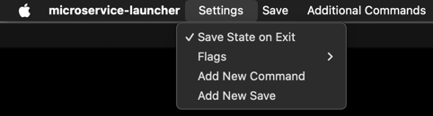

# Microservice Launcher
Microservice Launcher is cross-platform a C++ application using Qt framework for launching and managing microservices.


## Table of Contents
- [Introduction](#introduction)
- [Features](#features)
  - [Dynamic Directory Item Retrieval](#dynamic-directory-item-retrieval)
  - [Custom Short Name Extraction](#custom-short-name-extraction)
  - [Custom Ports Extraction](#custom-ports-extraction)
  - [Search Functionality](#search-functionality)
  - [Microservice Status Display](#microservice-status-display)
  - [Microservice Selection Checkbox](#microservice-selection-checkbox)
  - [Command Menu Customization](#command-menu-customization)
  - [Settings Menu](#settings-menu)
    - [Save State on Exit Checkbox](#save-state-on-exit-checkbox)
    - [Flags Management Menu](#flags-management-menu)
      - [Show Flag Control Panel](#show-flag-control-panel)
      - [Add New Flag Button](#add-new-flag-button)
      - [Apply Flags to All Services Button](#apply-flags-to-all-services-button)
      - [Remove Flags from All Services Button](#remove-flags-from-all-services-button)
    - [Add New Command Button](#add-new-command-button)
      - [Command Name](#command-name)
      - [Script Name](#script-name)
      - [Command](#command)
      - [Command Arguments](#command-arguments)
      - [Execute for selected services checkbox](#execute-for-selected-services-checkbox)
      - [Disable currently selected services checkbox](#disable-currently-selected-services-checkbox)
    - [Add New Save Button](#add-new-save-button)
  - [Save Menu](#save-menu)
  - [Additional Commands Menu](#additional-commands-menu)
  - [Custom Commands](#custom-commands)
  - [Standard Commands](#standard-commands)
    - [Select All](#select-all)
    - [Deselect All](#deselect-all)
    - [Refresh](#refresh)
  - [Configuration file](#configuration-file)
    - [Main](#main)
      - [Directory](#directory)
      - [ExcludedFolders](#excludedfolders)
    - [MainWindowButtons](#mainwindowbuttons)
    - [Save](#save)
    - [WindowSize](#windowsize)
      - [height](#height)
      - [width](#width)
- [Deployment](#Deployment)
  - [Mac OS](#mac-os)
  - [Linux](#linux)

## Introduction
Microservice Launcher is designed to simplify the local development of microservices by facilitating the launching, stopping, and monitoring of their states. Additionally, it supports the creation of custom commands that can be integrated into the UI.

## Features

### Dynamic Directory Item Retrieval
Microservice Launcher dynamically retrieves the names of all items located in a specified [Directory](#directory).

### Custom Short Name Extraction
Microservice Launcher extracts a custom short name for each microservice using a specified script, `short_name.sh`. This script accepts the following argument:
1. Directory of the microservice

If a short name is found, it will be displayed alongside the microservice's full name.

### Custom Ports Extraction
Microservice Launcher extracts custom ports for each microservice using a specified command located in a `ports.sh` file. This script accepts two arguments:
1. Directory of the microservice
2. [short name](#custom-short-name-extraction) (or empty string if not exist)

If ports are successfully retrieved, they are displayed alongside the microservice's name. These ports are utilized for monitoring the state of microservices and getting the microservice's PID.

### Search Functionality
The Microservice Launcher features a search bar that allows users to find microservices by name, short name, or ports. While users are typing, matching microservices are highlighted in real-time.

### Microservice Status Display
Users cannot directly control this checkbox; it updates automatically when the application starts, before executing a command with the [Execute for selected services](#execute-for-selected-services-checkbox) flag enabled, or when the [Refresh](#refresh) button is pressed. Depending on the status of the microservice, the checkbox changes its state:
- If a process with the name of the microservice exists, the checkbox will be checked.
- If there is no process with the name of the microservice and no [ports](#custom-ports-extraction) are in use, the checkbox will be unchecked.
- If no process with the name of the microservice exists but at least one [port](#custom-ports-extraction) is in use, the checkbox will be checked and marked green, indicating that the microservice is running in debug mode.

Refer to the image [above](#microservice-launcher).

### Microservice Selection Checkbox
The Microservice Launcher has checkboxes to select the microservices to which the command will be applied.

### Command Menu Customization
Microservice Launcher includes a command menu that allows users to organize commands with buttons. When adding a new command, a corresponding button in the menu is not automatically generated. Instead, users can configure the button layout — including the [number of rows](#mainwindowbuttons) and the size of each button — using the [Configuration file](#configuration-file).


### Settings Menu
Microservice Launcher includes a Settings menu where users can configure various options.



#### Save State on Exit Checkbox
- The `Save State on Exit` checkbox enables users to save the state of checkboxes before exiting the application.

#### Flags Management Menu
Menu `Flags` Provides options for managing flags.


- ##### Show Flag Control Panel
  - `Show Flag Control Panel` checkbox controls the visibility of flags under each microservice, showing or hiding them without disabling them.

- ##### Add New Flag Button
  - `Add New Flag` button allows users to input a new flag and save it.

- ##### Apply Flags to All Services Button
  - `Apply Flags to All Services` button opens a menu with all existing flags. By selecting a specific flag, users can apply it to all services without needing to activate the [Show Flag Control Panel](#show-flag-control-panel).

- ##### Remove Flags from All Services Button
  - `Remove Flags from All Services` button opens a menu with all existing flags. By selecting a specific flag, users can remove it from all services without needing to activate the [Show Flag Control Panel](#show-flag-control-panel).

#### Add New Command Button
- The `Add New Command` button opens a window for inputting parameters for a new command. After creating a command, the new command button immediately appears in the [Additional Commands](#additional-commands-menu) menu.


##### Command Name
- The `Command Name` will be used as the name of the button that will be used to execute the command. Also by this name it will be possible to find this command in the [Configuration file](#configuration-file) and change other parameters or the size of the button.

##### Script Name
- One script can be used by different commands. The script must be located in the root of the application, with the given name.

##### Command
- Thanks to `Command`, you can use the same [script](#script-name) for different commands by passing different commands to it. Command is an optional argument.

##### Command Arguments
- A list of arguments to be requested from the user before executing the command. The arguments will be passed to the script along with the [rest of the arguments](#custom-commands).

##### Execute for selected services checkbox
- If checked, the script will be executed only for selected services. Otherwise, the script will be executed one time.

##### Disable currently selected services checkbox
- If checked, the script will ignore currently selected services. Works only if [Execute for selected services](#execute-for-selected-services-checkbox) checkbox enabled.

#### Add New Save Button
- The `Add New Save` button prompts users to enter a name for the new save, saves all selected checkboxes, and adds the save with the specified name to the Save menu.

### Save Menu
- Save menu contains all saves, created with [Add New Save Button]((#add-new-save-button)). By clicking on the save, the state of saved checkboxes will be restored.

### Additional Commands Menu
- This menu contains all commands, including main menu commands.

### Custom Commands
Depending on [Execute for selected services](#execute-for-selected-services-checkbox) flag, different arguments will be passed to the script when it is executed:

- If [Execute for selected services](#execute-for-selected-services-checkbox) was **not** checked, the order of arguments will be as follows:
1. Command (or empty string if not exist)
2. [Directory](#directory)
3. List of command arguments (if were provided while command creation process)

- If [Execute for selected services](#execute-for-selected-services-checkbox) was checked, the order of arguments will be as follows:
1. Command (or empty string if not exist)
2. [Directory](#directory)
3. Process name
4. [Short name](#custom-short-name-extraction) (or empty string if not exist)
5. PID of process (or empty string if process is not launched)
6. List of command arguments (if were provided while command creation process)
7. List of enabled flags (if exists)

### Standard Commands
Microservice Launcher provides three default commands that are available to the user by default: [Select All](#select-all), [Deselect All](#deselect-all), and [Refresh](#refresh). The position, presence, and size of the standard command buttons can be [customized](#command-menu-customization) through the [Configuration file](#configuration-file). Each command serves a specific purpose as described below:

#### Select All
- The `Select All` command selects all microservices by checking the [Microservice Selection Checkbox](#microservice-selection-checkbox) for each microservice.

#### Deselect All
- The `Deselect All` command deselects all microservices by unchecking the [Microservice Selection Checkbox](#microservice-selection-checkbox) for each microservice.

#### Refresh
The `Refresh` button allows users to manually update the [status indicator checkboxes](#microservice-status-display) for all microservices.

### Configuration file
The `config.ini` file defines the behavior and layout of the Microservice Launcher application. Below is a detailed explanation of each section and its parameters.

- #### Main
General settings for the application.
  - ##### Directory
    - The directory where all microservices are located.
  - ##### ExcludedFolders
    - List of directories within the [Directory](#directory) that should be ignored.
- #### MainWindowButtons
The `MainWindowButtons` section defines the layout of buttons displayed in the main application window. Each entry in this group represents a row of buttons, where the order and names of buttons are specified as a comma-separated list.
  - Entry Format: Each row is labeled as `buttonLayoutX`, where `X` is a unique number (e.g., `buttonLayout1`, `buttonLayout2`).
  - Button List: Buttons in each row are listed in the desired order and separated by commas.
  - Flexibility: The number of rows (`buttonLayout` entries) and the number of buttons in each row are flexible. You can add as many rows or buttons as needed to [customize](#command-menu-customization) the interface layout.
- #### Save
The `Save` section keeps a group of services that will be launched by clicking the button with the corresponding name in the [Save Menu](#save-menu).
The number of saves is not limited. Each Save group starts with the group's name and contains a comma-separated list of services.
- #### WindowSize
The `WindowSize` section defines the size of the main window in pixels.
  - ##### height
    - The height of the main window in pixels.
  - ##### width
    - The width of the main window in pixels.

## Deployment
  - ### Mac OS
To build the project on macOS, follow these steps:

1. Download Qt for open source use from the [official website](https://www.qt.io/download-qt-installer-oss). 
2. Open the project in Qt Creator.
3. Select the `Release` profile.
4. Build the project.
5. Copy the built application to the Desktop.
6. Use the `macdeployqt` tool to deploy the application:
```sh
   $HOME/Qt/6.7.2/macos/bin/macdeployqt $HOME/Desktop/MicroserviceLauncher.app
```
7. Zip the application and send it to the recipient.
8. The recipient needs to unzip the application and run the following command to remove the quarantine attribute:
```sh
   xattr -d com.apple.quarantine $HOME/Downloads/MicroserviceLauncher.app
```

  - ### Linux
To build the project on Linux (tested on Ubuntu 20.04.6 LTS), follow these steps:

1. Download Qt for open source use from the [official website](https://www.qt.io/download-qt-installer-oss).
2. Install C++ compiler:
```sh
   sudo apt install g++
```
3. Open the project in Qt Creator.
4. Select the `Release` profile.
5. Build the project.
6. Copy the built application to the `Desktop/MicroserviceLauncher` folder.
7. Create a `MicroserviceLauncher.desktop` file in this folder.
8. Download the `linuxdeployqt` tool from the [official repository](https://github.com/probonopd/linuxdeployqt/releases/tag/continuous).
9. Run the following command to deploy the application:
```sh
   $HOME/Downloads/linuxdeployqt-continuous-x86_64.AppImage $HOME/Desktop/MicroserviceLauncher/MicroserviceLauncher.desktop -appimage
```
10. Zip the application and send it to the recipient.
11. The recipient needs to unzip the application.